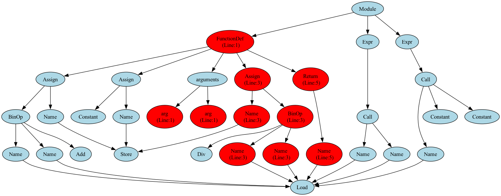

# AI-Powered Code Analyzer

A Python tool that uses GPT-4 and Abstract Syntax Trees to find bugs in code and visualize them.

## What It Does

Parses Python code into an AST, sends it to GPT-4 to detect errors, then generates a diagram highlighting the buggy parts in red.

## Why I Built This

I wanted to understand how compilers work under the hood and see if AI could help catch bugs that traditional tools miss. Plus, I thought visualizing code as a tree would be a cool way to learn about ASTs.

## Tech Stack

- Python AST module for parsing
- OpenAI GPT-4 API for error detection  
- Graphviz for visualization

## Setup
```bash
pip install openai python-dotenv graphviz
brew install graphviz  # Mac only
```

Create `api.env`:
```
OPENAI_API_KEY=your_key_here
```

## Usage
```bash
python auto_tree.py
```

Check out `auto_ast_result.png` for the visualization.

## Example

**Code analyzed:**
```python
def calculate(x, y):
    z = x + y
    result = x / y  # Bug: divides by zero
    unused_var = 10
    return result

calculate(5, 0)
print(undefined_variable)  # Bug: undefined
```

**AI Response:**
```
Analyzing code.....
AI Response: 3, 7, 8
```

**Visual Output:**



Red nodes show where the errors are (division by zero on line 3, undefined variable on line 8).

## What I Learned

- How Python represents code internally using ASTs
- Working with external APIs and handling responses
- The strengths and limitations of AI for code analysis
- Visualizing tree data structures
- Debugging misaligned line numbers between AI output and AST nodes

## Challenges I Ran Into

**Line numbers weren't matching up:** The AI would say "error on line 1" but my AST showed a different line. Turned out I needed to send the code with explicit line numbers so the AI and my visualization were talking about the same lines.

**Too much red:** At first, entire sections of the tree turned red when there was one error. Fixed this by only highlighting specific node types (like BinOp, Name, Call) instead of every single node on that line.

## Future Ideas

- Add command-line support for analyzing any file
- Compare AI results with pylint/flake8
- Support more languages
- Generate fix suggestions

## Limitations

- Needs OpenAI API key (costs money)
- AI sometimes gives false positives/negatives
- Only works with Python
- Code must be syntactically valid to visualize

Built this to explore how compilers work and mess around with AI!
